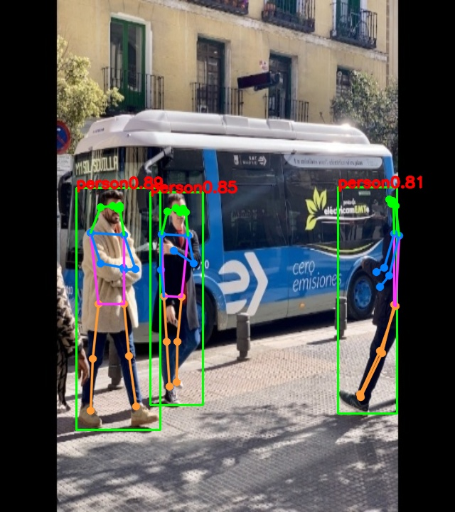

# yolov8_pose
c++ in rk3588

## 1. Description

The model used in this example comes from the following open source projects:  

https://github.com/airockchip/ultralytics_yolov8

yolov8n-pose pt model download link: 

[yolov8n-pose.pt](https://github.com/ultralytics/assets/releases/download/v8.2.0/yolov8n-pose.pt)<br />


## 2. Current Support Platform

RK3566, RK3568, RK3588, RK3562, RK3576


## 3. Pretrained Model

Download link: 

[./yolov8n-pose.onnx](https://ftrg.zbox.filez.com/v2/delivery/data/95f00b0fc900458ba134f8b180b3f7a1/examples/yolov8_pose/yolov8n-pose.onnx)

Download with shell command:

```
cd model
./download_model.sh
```


## 4. Convert to RKNN

*Usage:*

```shell
cd python
python convert.py <onnx_model> <TARGET_PLATFORM> <dtype(optional)> <output_rknn_path(optional)>

# such as: 
python convert.py ../model/yolov8n-pose.onnx rk3588
# output model will be saved as ../model/yolov8n-pose.rknn
# Currently the C code demo only supports 8-bit quantization
```

*Description:*

- `<onnx_model>`: Specify ONNX model path.
- `<TARGET_PLATFORM>`: Specify NPU platform name. Support Platform refer [here](#2-current-support-platform).
- `<dtype>(optional)`: Specify as `i8` or `fp`. `i8` for doing quantization, `fp` for no quantization. Default is `i8`.
- `<output_rknn_path>(optional)`: Specify save path for the RKNN model, default save in the same directory as ONNX model with name `yolov8n-pose.rknn`


## 5. Python Demo

*Usage:*

```shell
cd python
# Inference with PyTorch model or ONNX model
python yolov8_pose.py --model_path <pt_model/onnx_model>

# Inference with RKNN model
python yolov8_pose.py --model_path <rknn_model> --target <TARGET_PLATFORM>
```
*Description:*
- <TARGET_PLATFORM>: Specify NPU platform name. Such as 'rk3588'.

- <pt_model / onnx_model / rknn_model>: specified as the model path.


## 6. Linux Demo

#### 6.1 Compile and Build

cd yolov8_pose
mkdir build && cd build
cmake ..
make


#### 7. Run demo

cd build 
./yolov8_video_pose ../model/yolov8_pose.rknn ../model/bus.jpg

- After running, the result was saved as `out.png`. 


## 8. Expected Results

This example will print the labels and corresponding scores of the test image detect results, as follows:
```
person @ (209 244 286 506) 0.884
person @ (478 238 559 526) 0.868
person @ (110 238 230 534) 0.825

```


<br>
- Note: Different platforms, different versions of tools and drivers may have slightly different results.
